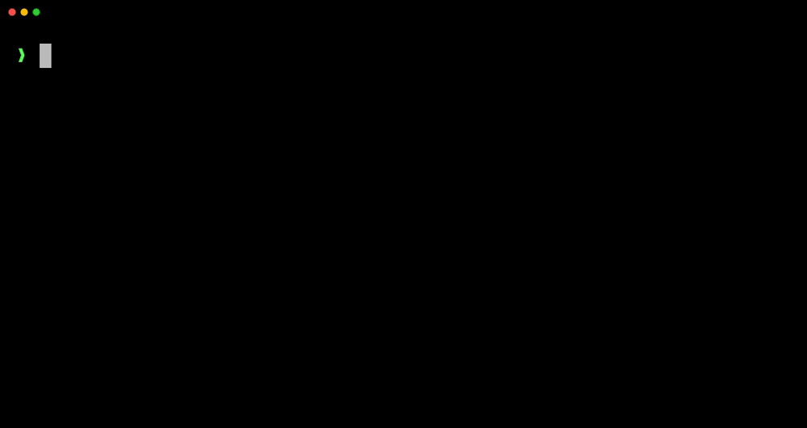

<p align="center">
  <picture>
    <source media="(prefers-color-scheme: dark)" srcset="./assets/logo-dark.svg" />
    <source media="(prefers-color-scheme: light)" srcset="./assets/logo-light.svg" />
    
  </picture>
</p>

<p align="center">
  <strong>Sync your AI tool configs across machines and teams.</strong><br />
  One command to push, one to pull.
</p>

<p align="center">
  <a href="https://www.npmjs.com/package/lazy-raccoon"></a>
  <a href="https://github.com/fpuglap/lazy-raccoon-cli/blob/main/LICENSE"></a>
</p>

<p align="center">
  <a href="https://lazyraccoon.dev"><strong>Website</strong></a> ·
  <a href="https://docs.lazyraccoon.dev"><strong>Docs</strong></a> ·
  <a href="https://lazyraccoon.dev/dashboard"><strong>Dashboard</strong></a>
</p>

<h4 align="center">🚀 Push your configs</h4>
<p align="center">
  
</p>

<h4 align="center">🐿️ Pull them anywhere</h4>
<p align="center">
  
</p>

<h4 align="center">🎯 Check sync status</h4>
<p align="center">
  
</p>

## Why

Every time you switch machines or onboard a new teammate, you reconfigure your AI tools from scratch — rules, MCP servers, agents, settings. Lazy Raccoon fixes that. Push your config once, pull it anywhere. Share it across teams.

## Supported tools

| Tool | Config path |
|------|-------------|
| Claude Code | `~/.claude/` |
| Cursor | `~/.cursor/` |
| GitHub Copilot | `~/.copilot/` |
| Gemini CLI | `~/.gemini/` |
| Windsurf | `~/.codeium/windsurf/` |
| Cline | `~/.cline/` |

## Quick start

```bash
npm install -g lazy-raccoon
lazy login
lazy push
```

That's it. Your config is in the cloud. Pull it on any other machine:

```bash
lazy pull
```

## Commands

| Command | Description |
|---------|-------------|
| `lazy login` | Authenticate via browser |
| `lazy logout` | Remove stored credentials |
| `lazy push` | Upload local config to cloud |
| `lazy pull` | Download cloud config to local |
| `lazy status` | List all synced configs |
| `lazy whoami` | Show current logged-in user |
| `lazy teams` | List your teams |
| `lazy teams create <name>` | Create a new team |
| `lazy teams info <slug>` | Show team members |
| `lazy teams invite <slug> <email>` | Invite someone to a team |
| `lazy teams leave <slug>` | Leave a team |
| `lazy teams invitations` | List pending invitations |
| `lazy teams accept <id>` | Accept an invitation |

## Flags

| Flag | Commands | Description |
|------|----------|-------------|
| `--tool <id>` | push, pull | Choose tool: `claude`, `cursor`, `copilot`, `gemini`, `windsurf`, `cline` |
| `--team <slug>` or `-T` | push, pull | Push/pull for a team instead of personal |
| `--force` | push, pull | Skip merge, fully overwrite |
| `--profile <name>` | push, pull | Use a named profile |
| `--dir <path>` | pull | Pull to a custom directory |

## Smart merge

By default, push and pull use smart merge:

- **push**: local wins on conflicts, cloud-only fields are preserved
- **pull**: cloud wins on conflicts, local-only fields are preserved

Both commands show a diff preview and ask for confirmation before applying. Pull creates a backup before writing.

Use `--force` to skip merge and fully overwrite.

## Teams

Share configs across your team:

```bash
lazy teams create "My Team"
lazy push --team my-team
```

Team members pull the shared config:

```bash
lazy pull --team my-team
```

Invite members:

```bash
lazy teams invite my-team dev@company.com
```

## What gets synced

Each tool defines which files and directories are synced:

| Tool | Files synced |
|------|-------------|
| Claude Code | `CLAUDE.md`, `settings.json`, `.mcp.json`, `commands/`, `agents/`, `skills/`, `rules/` |
| Cursor | `rules/*.mdc`, `mcp.json` |
| GitHub Copilot | `copilot-instructions.md`, `config.json`, `mcp-config.json`, `agents/` |
| Gemini CLI | `GEMINI.md`, `settings.json`, `commands/` |
| Windsurf | `memories/global_rules.md` |
| Cline | `cline_mcp_settings.json` |

Sensitive files (`.env`, API keys, tokens, caches, logs) are **never** synced.

## Security

- All config data is **encrypted at rest** (AES-256-GCM) before being stored
- Data in transit is protected by HTTPS
- Auth tokens are stored locally in `~/.lazy-raccoon/credentials.json`

## Environment variables

| Variable | Description |
|----------|-------------|
| `CLAUDE_DIR` | Override `~/.claude` path |

## Development

```bash
git clone https://github.com/fpuglap/lazy-raccoon-cli.git
cd lazy-raccoon-cli
npm install
npm run build
npm link
```

## License

MIT
